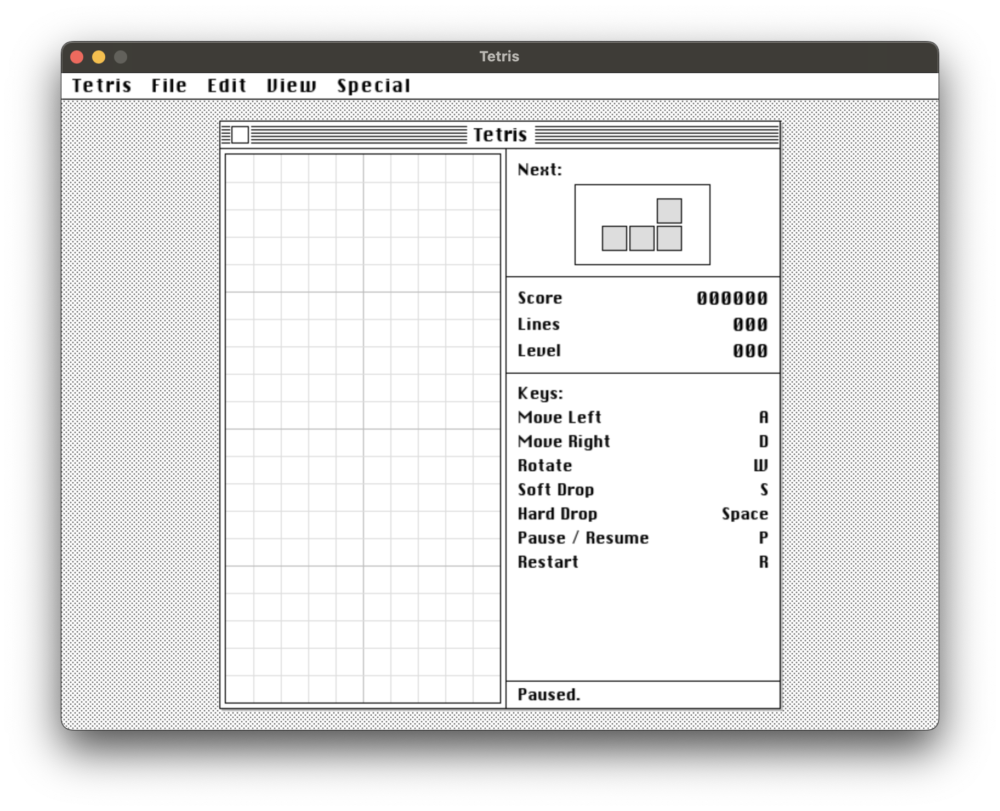

# Oh My Tetris

一局干净、直接、带一点老桌面窗口感的俄罗斯方块。

`Oh My Tetris` 是一个基于 `pygame` 的本地单机项目：标准 `10×20` 棋盘、七种经典方块、`SRS` 旋转与踢墙、七袋随机，以及一套已经整理好的复古桌面风格界面。



## 这局方块有什么

- 标准 `10×20` 棋盘，包含 `I / O / T / L / J / S / Z` 七种经典方块。
- 使用七袋随机（`7-bag`）发牌，不会太早把同一种方块耗光。
- 基于 `SRS`（Super Rotation System）实现旋转与踢墙。
- 提供影子落点预览和下一个方块预览，方便提前规划。
- 支持局内暂停和重开，不需要重启程序。
- 支持 `DAS`、`ARR`、软降重复和锁定延迟，移动和落地手感更完整。
- 消除 `10` 行升一级；分数按单消 `40`、双消 `100`、三消 `300`、四消 `1200` 计算，再乘以 `等级 + 1`。
- 右侧信息栏会实时显示分数、消行、等级、按键说明和当前状态。
- 窗口失焦时会自动暂停，重新点回窗口后才会继续接收键盘输入。

## 跑起来很直接

- Python `3.10+`
- 能正常显示桌面窗口的运行环境
- 根目录保留 `CHICAGO.TTF` 字体文件

仓库里已经附带 `CHICAGO.TTF`，正常情况下不需要额外准备字体。下面的示例默认按 `python3` 来写；如果你的系统里没有这个命令，也可以改用 `python`，Windows 下通常可以用 `py -3`。

最短路径只需要两条命令：

```bash
python3 -m pip install -r requirements.txt
python3 tetris.py
```

如果你习惯先创建虚拟环境，在 macOS / Linux 上可以这样跑：

```bash
python3 -m venv .venv
source .venv/bin/activate
python -m pip install -r requirements.txt
python tetris.py
```

如果你在 Windows PowerShell 下，写法是这样：

```powershell
py -3 -m venv .venv
.venv\Scripts\Activate.ps1
python -m pip install -r requirements.txt
python tetris.py
```

## 操作很简单

| 操作      | 说明      |
|---------|---------|
| `A`     | 向左移动    |
| `D`     | 向右移动    |
| `W`     | 顺时针旋转   |
| `S`     | 软降      |
| `Space` | 硬降      |
| `P`     | 暂停 / 恢复 |
| `R`     | 重置当前对局  |
| 关闭窗口    | 退出游戏    |

## 想改几个参数

如果你想调一下速度、计分或界面，主要看这几个位置：

- `tetris_core.py` 里的 `TIMING` 和 `FALL_FRAMES` 控制掉落速度、横向移动节奏和锁定延迟。
- `tetris_core.py` 里的 `SCORES` 控制不同消行数的得分规则。
- `tetris_ui_config.py` 里的 `UI_COLORS`、`GAME_LAYOUT` 和 `CONTROL_BINDINGS` 控制界面风格、布局尺寸和按键映射。
- 如果你想改棋盘宽高，先调整 `BOARD_WIDTH`、`BOARD_HEIGHT`，再同步检查界面布局是否还能放得下。

## 目录里有什么

```text
.
├── tetris.py
├── tetris_core.py
├── tetris_ui.py
├── tetris_ui_config.py
├── tetris_ui_helpers.py
├── requirements.txt
├── CHICAGO.TTF
├── screenshot.png
├── LICENSE
└── README.md
```

## 代码怎么分工

- `GameplayEngine` 负责规则：棋盘状态、方块生成、旋转、消行、计分和掉落时序。
- `TetrisUI` 负责界面：窗口外壳、棋盘、方块、预览区、信息栏和状态提示。
- `tetris_ui_config.py` 负责配置：布局常量、配色、字体路径和按键绑定。
- `tetris_ui_helpers.py` 负责辅助：几何计算和一些无状态的界面工具函数。
- `TetrisGame` 负责把事件循环、渲染和规则调度到一起。
- 程序入口在 `main()`，最终由 `TetrisGame.run()` 启动主循环。

## 常见问题

**1. 启动时报 `No module named 'pygame'`**

说明你当前用来启动程序的 Python 解释器还没有装上依赖。用同一个解释器重新安装依赖即可，例如：

```bash
python3 -m pip install -r requirements.txt
```

**2. 启动时报找不到字体文件**

常见报错通常包括 `Required font not found ...` 或 `Unable to load font ...`。先确认 `CHICAGO.TTF` 还在项目根目录；如果你换了字体文件位置，也要同步更新 `tetris_ui_config.py` 里的 `CHICAGO_FONT_PATH`。

**3. 程序无法打开窗口**

这通常说明当前环境没有可用的图形界面。这个项目是桌面 GUI 程序，纯终端或无显示服务的远程环境里一般无法正常运行 `pygame` 窗口。

## 许可证

本项目使用 [MIT License](LICENSE)。
